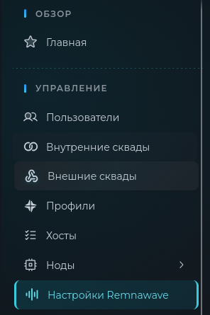
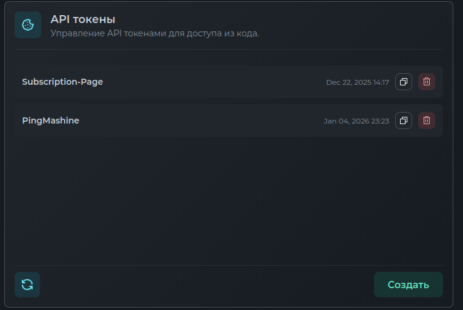

# Сервис для добавления индикаторов доступности хостов RemnawaveAPI

Бот обращается к панели с заданным интервалом, получает статусы подключения НОД и переименовывает хосты. Опционально, поддерживает PingNodePlugin (проверка доступности не только тонеля, но хаста в целом).

## Настройка

### Файл конфигурации
Файл конфигурации генерируется автоматически плагином при загрузке. После этого нужно донастроить его

Заполните 

```json
REMNAWAVE_INTERVAL=1 # Период проверки состояния нод в секундах

REMNAWAVE_HOST=""    # Домен панели Remnawave 
REMNAWAVE_TOKEN=""   # Токен из настроек панели Remnawave 
REMNAWAVE_COOKIE=""  # COOKIE из https://{host}/auth/login?{COOKIE}

TELEGRAM_TOKEN=      # Токен бота
TELEGRAM_CHAT_ID=    # Идентификатор чата
``` 

### Получение API-токена Remnawave

Перейдите в настройки Remnawave



Создайте токен в разделе с токенами API




### Что за COOKIE?

Если панель установлена через скрипт от (egam.es)[https://wiki.egam.es/ru/installation/panel-only/] - страница панели защищена секретным ключом.
При установке скрипт даёт ссылку на доступ к панели:
`https://p.example.com/auth/login?SECRET_KEY=SECRET_KEY`
Из этой ссылки `SECRET_KEY=SECRET_KEY` и есть наши COOKIE. 


## Запуск 

Запустить PluginLoader из пакета [PluginCore](https://github.com/d3156/PluginCore)

```bash
./PluginLoader
```

## Автозапуск
Создать файл в /etc/systemd/system/remnawave_node_monitor.service
```systemctl
[Unit]
Description=RemnawaveServices
After=network.target

[Service]
Type=simple
User=root
WorkingDirectory=/opt/RemnawaveServices
ExecStart=/opt/RemnawaveServices/PluginLoader
StandardOutput=append:/var/log/remnawave_node_monitor.log
StandardError=append:/var/log/remnawave_node_monitor-error.log
Restart=on-failure
RestartSec=2

[Install]
WantedBy=multi-user.target
```

